# MongoDB Day 1

## 1.Find all the information about each products

```json

db.products.find()

```

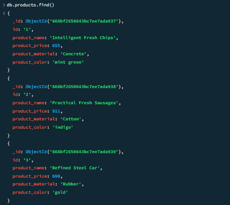

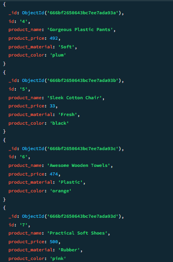

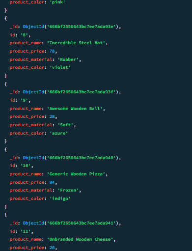

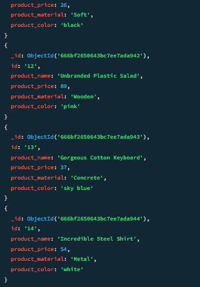

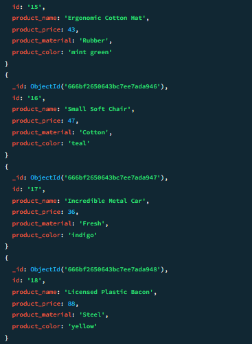

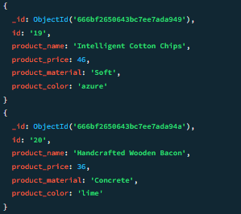

## 2.Find the product price which are between 400 to 800

```json

db.products.find({'product_price':{'$gte':400,'$lte':800}})

```

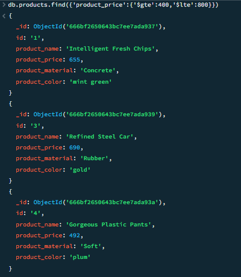

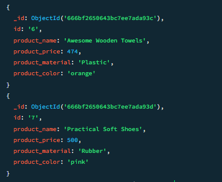

## 3.Find the product price which are not between 400 to 600

```json
db.products.find({'product_price':{'$not':{'$gte':400,'$lte':600}}})
```

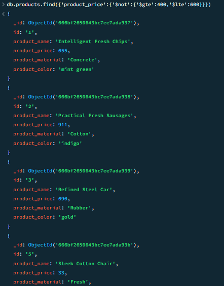

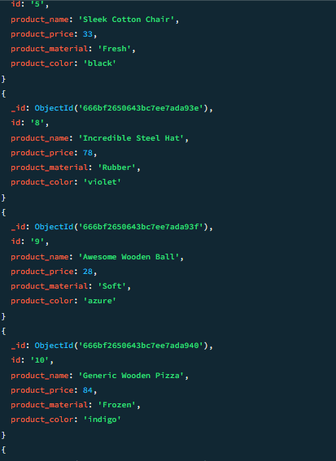

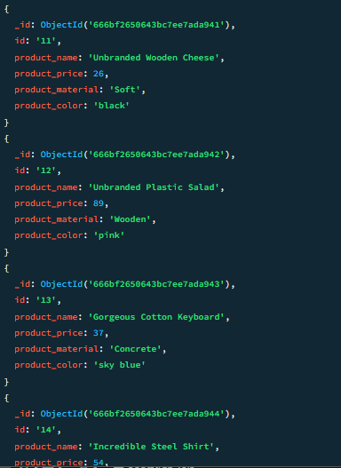

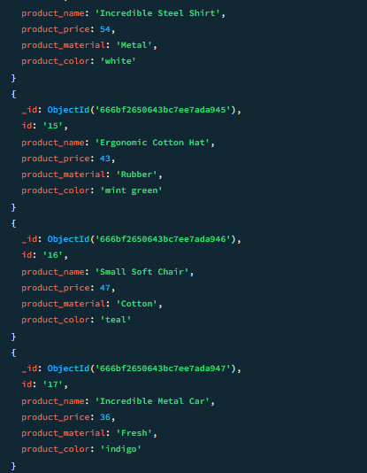

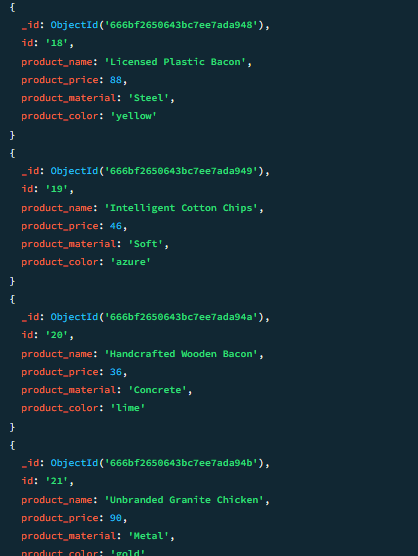

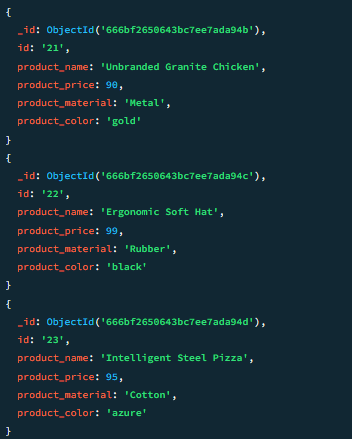

## 4.List the four product which are greater than 500 in price

```json
db.products.find({},{product_name:1, product_material:1})

```

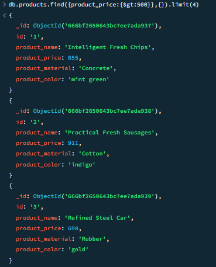

## 5.Find the product name and product material of each products

```json
db.products.find({},{product_name:1, product_material:1})
```

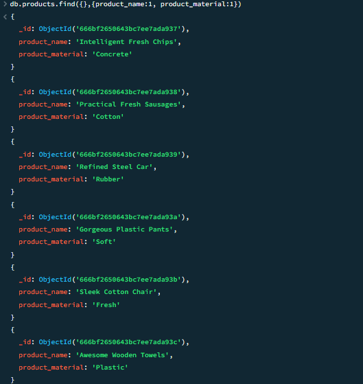

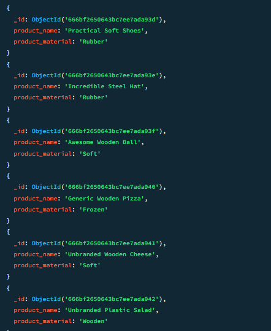


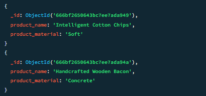

## 6.Find the product with a row id of 10

```json
db.products.find({id:"10"},{})
```

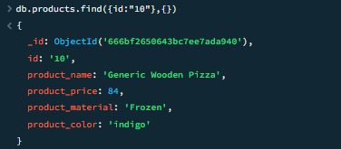

## 7.Find only the product name and product material

```json
db.products.find({}, {_id: 0, product_name: 1, product_material: 1})

```

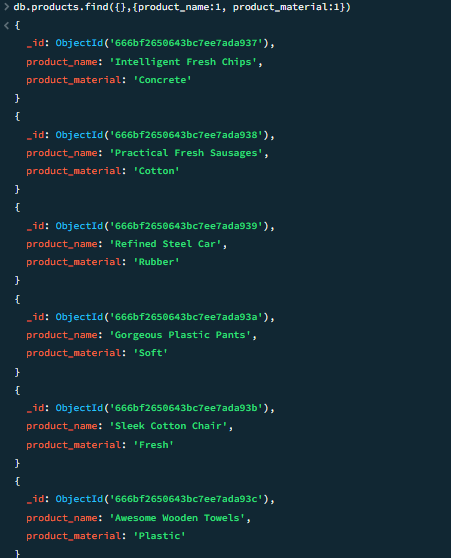

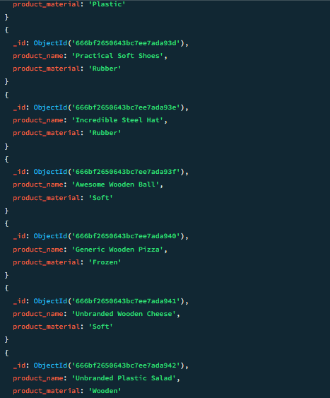

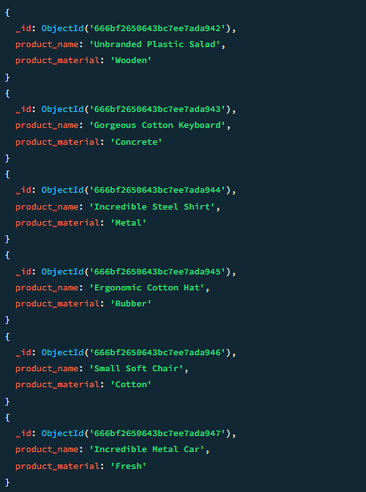

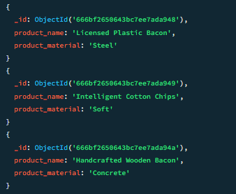

## 8.Find all products which contain the value of soft in product material

```json
db.products.find({product_material: "Soft"})
```

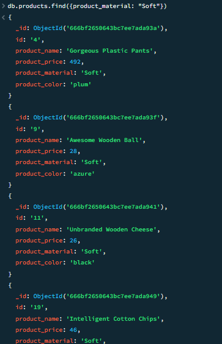

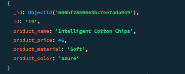

## 9.Find products which contain product color indigo and product price 492.00

```json
db.products.find({ product_color: "indigo",product_price: 492.00})

```

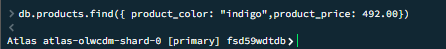

## 10.Delete the products which product price value are 28

```json
db.products.deleteOne({product_price:28})
```

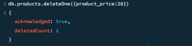
